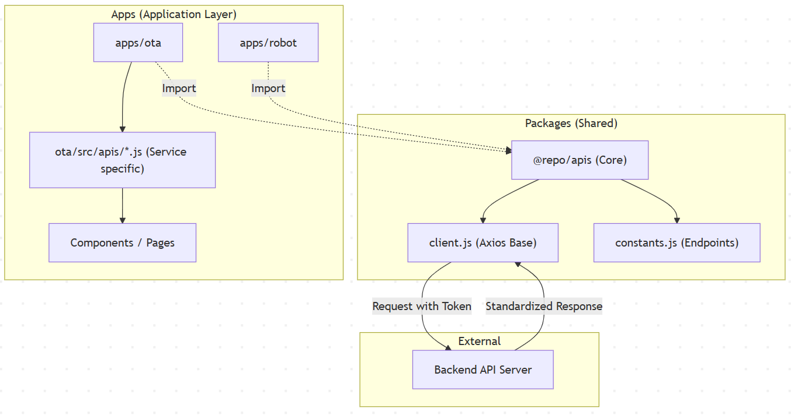

# 프로젝트 소개

이 프로젝트는 운영 관리 시스템의 다양한 모듈을 관리하는 모노레포 구조의 프로젝트입니다.

<br />
<br />

## 사전 준비

- Node version 24.13.0
- Pnpm version 10.30.3
- Turbo version 2.8.1

## Turborepo global 설치

```
pnpm setup
# re-open terminal
pnpm add turbo --global
```

### Apps and Packages

- `main`: a [Vite](https://vitejs.dev/) + [React](https://reactjs.org/) app
- `ota`: another [Vite](https://vitejs.dev/) + [React](https://reactjs.org/) app
- `@repo/ui`: a stub React component library shared by all applications
- `@repo/stores`: a stub store library shared by all applications
- `@repo/apis`: a stub API client library shared by all applications
- `@repo/hooks`: a stub hooks library shared by all applications
- `@repo/locales`: a stub locales library shared by all applications

Each package/app is 100% [JavaScript](https://developer.mozilla.org/en-US/docs/Web/JavaScript)

### App 추가

상세한 가이드는 [ADD_APP.md](./ADD_APP.md)를 참조하세요.

### Utilities

- [Prettier](https://prettier.io) for code formatting (need to install extension in VSCode)
- [Lint]

### 전체 패키지 설치
```
pnpm install
```
### 로컬 서버 실행
```
pnpm dev
```

### 전체 빌드
```
pnpm build
```

### 특정 앱 빌드
```
pnpm build --filter=[app-name]
```

<br />
<br />

# API 사용 가이드

monorepo 환경에서 공통 API 라이브러리(`@repo/apis`)를 사용하여 새로운 API 호출 기능을 구현하는 개발자를 위한 종합 가이드

---

## 1️⃣ 3-Step Quick Start (패턴 요약)

새로운 기능을 개발할 때 따라야 할 가장 기본적인 3단계 Flow

### Step 1: API 파일 생성 및 클라이언트 초기화

각 앱의 `src/apis` 폴더에 파일을 생성하고, 공통 `client`를 가져와 앱 전용 Axios 인스턴스를 생성

```javascript
// apps/ota/src/apis/serviceApis.js
import { client, ENDPOINTS } from '@repo/apis'

// 환경 변수(VITE_API_BASE_URL)를 사용하여 클라이언트 생성
const axiosService = client(import.meta.env.VITE_API_BASE_URL)
```

### Step 2: API 함수 정의 (Async/Await)

비즈니스 로직에 맞는 API 함수를 정의하고 `export` 함

```javascript
/**
 * 서비스 목록 조회
 */
export const retrieveServices = async () => {
  try {
    const response = await axiosService.get(ENDPOINTS.SERVICE.LIST)
    return response // 인터셉터에서 response.data를 반환하도록 되어 있음
  } catch (error) {
    console.error('Failed to retrieve services:', error)
    throw error
  }
}
```

### Step 3: 컴포넌트에서 호출

만든 API 함수를 UI 컴포넌트 내에서 호출. (주로 `useEffect`와 연계)

```jsx
import { retrieveServices } from './apis/serviceApis'

const ServiceList = () => {
  useEffect(() => {
    const loadData = async () => {
      const data = await retrieveServices()
      console.log('Loaded data:', data)
    }
    loadData()
  }, [])
  // ...
}
```

---

## 2️⃣ Architecture Blueprint (구조도)

전체적인 데이터 흐름과 모듈 간의 관계.



- **@repo/apis**: 공통 헤더(Auth Token), 인터셉터(Header injection, Error handling)가 미리 정의되어 있음.
- **apps/\* **: 개별 앱은 공통 클라이언트를 가져와서 자기 앱에 필요한 `Base URL`만 주입하여 사용.

---

## 3️⃣ 더미 데이터 전략

백엔드가 아직 완성되지 않았거나, 특정 시나리오를 테스트해야 할 때 유용

### 추천 패턴: Try-Catch 더미 반환

현재 프로젝트 API 파일들에서 사용 중인 방식. 실제 호출 코드를 주석 처리하고 더미 데이터를 반환.

```javascript
export const retrieveData = async () => {
  try {
    // [개발 중] 실제 서버 연결 시 주석 해제
    // return await axiosService.get('/path')

    // Dummy Data 반환
    return {
      status: 200,
      data: [{ id: 1, name: 'Dummy Item' }]
    }
  } catch (error) {
    // ...
  }
}
```

> [!TIP]
> 백엔드 완료 후에는 `//` 주석만 제거하면 바로 실제 서버와 통신할 수 있어 유용.

---

## 4️⃣ 네이밍 및 에러 핸들링 (Best Practices)

### 네이밍 컨벤션

함수 이름만 보고도 어떤 동작을 하는지 알 수 있도록 일관된 동사를 사용

| 동사          | 의미                         | 예시                  |
| :------------ | :--------------------------- | :-------------------- |
| `retrieve...` | 단일 또는 목록 조회 (GET)    | `retrieveCampaign` |
| `create...`   | 새로운 리소스 생성 (POST)    | `saveCampaign`    |
| `modify...`   | 기존 리소스 수정 (PUT/PATCH) | `modifyStatus`        |
| `remove...`   | 리소스 삭제 (DELETE)         | `removeArtifact`      |

### 에러 핸들링

`@repo/apis/client.js`의 `response interceptor`가 기본적인 에러(401, 403, 500 등)를 처리.

- 토큰 만료 시 자동으로 로그인 페이지로 유도하거나 콘솔에 에러를 기록.
- 각 API 함수에서는 `try-catch`를 통해 추가적인 비즈니스 로직(예: 사용자 알림)을 구현할 수 있음.

---

## 5️⃣ API Skeleton Template (Cheat Sheet)

새로운 API 파일을 만들 때 이 코드를 복사해서 사용

```javascript
/* [파일명] apps/{app-name}/src/apis/{feature}Apis.js */
import { client, ENDPOINTS } from '@repo/apis'

// 1. 클라이언트 초기화
const api = client(import.meta.env.VITE_API_BASE_URL)

/**
 * [기능명] 조회
 */
export const retrieveItems = async (params) => {
  try {
    const response = await api.get(ENDPOINTS.FIXME.PATH, { params })
    return response
  } catch (error) {
    console.error('API Error (retrieveItems):', error)
    throw error
  }
}

/**
 * [기능명] 생성
 */
export const createItem = async (data) => {
  try {
    const response = await api.post(ENDPOINTS.FIXME.PATH, data)
    return response
  } catch (error) {
    console.error('API Error (createItem):', error)
    throw error
  }
}


/**
 * [기능명] 수정
 */
export const modifyItem = async (data) => {
  try {
    const response = await api.put(ENDPOINTS.FIXME.PATH, data)
    return response
  } catch (error) {
    console.error('API Error (modifyItem):', error)
    throw error
  }


/**
 * [기능명] 삭제
 */
export const removeItem = async (data) => {
  try {
    const response = await api.delete(ENDPOINTS.FIXME.PATH, data)
    return response
  } catch (error) {
    console.error('API Error (removeItem):', error)
    throw error
  }

```

<br />
<br />

## 환경 변수 사용 가이드
monorepo 환경에서 앱별로 정의한 환경변수와 공통으로 정의한 환경변수를 사용할 수 있도록 각 앱별 vite.config.js에 loadEnv를 사용하여 환경변수를 로드하도록 설정함.

```javascript
// apps/[app-name]/vite.config.js
import { defineConfig, loadEnv } from 'vite'
import { resolve } from 'path'
import federation from '@originjs/vite-plugin-federation'

export default defineConfig(async ({ mode }) => {
  const apiEnv = loadEnv(mode, resolve(__dirname, '../../packages/apis'), 'VITE_')
  const envDefines = Object.keys(apiEnv).reduce((acc, key) => {
    acc[`import.meta.env.${key}`] = JSON.stringify(apiEnv[key])
    return acc
  }, {})

  return {
    define: envDefines,
    // ...
  }
})
```

1. `apps/[app-name]/.env` 파일을 생성하고 `import.meta.env.VITE_`로 사용할 수 있음.
2. 공통 환경 변수를 사용하기 위해서는 `packages/apis/.env` 파일을 생성하고 `import.meta.env.VITE_`로 사용할 수 있음.

- .env 내 변수명은 대문자로 작성해야 하며 VITE_ 접두사를 붙이도록 함
- 단 공통 환경 변수와 앱별 환경 변수가 중복될 경우 앱별 환경 변수가 우선하므로 변수명 작성시 유의해야 함.


<br />
<br />

#### Local hosting 대상 앱 중 Firebase 배포해야 할 경우에 대한 가이드 (only Setup App)

```bash
# Prerequisites
npm install -g firebase-tools

# Login
firebase login

# Execute script on setup app
cd apps/setup
pnpm run deploy
```